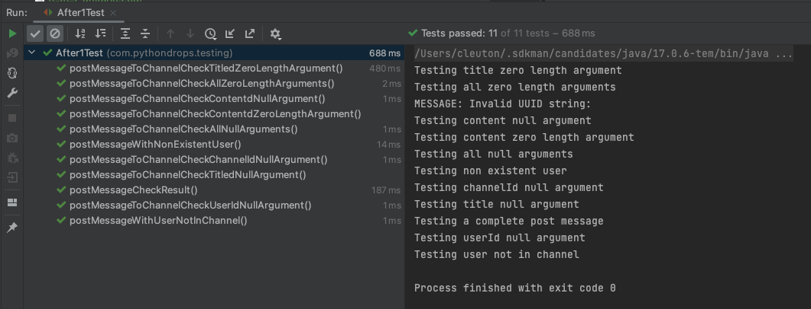

# Tutorial de Teste unitário

**c) 2023 [Cleuton Sampaio](https://linkedin.com/in/cleutonsampaio)**

Você sabe criar testes unitários efetivos? Existem técnicas para criar testes unitários. Veja o [PDF anexado](./testes_unitarios.pdf) ao projeto.

## Um estudo de caso

O projeto deste tutorial é parte de um projeto real em que eu estava trabalhando, devidamente desidentificado e modificado. O código é para ser utilizado como está, sem tentar refatorar ou implementar **cleancode**. O objetivo é criar testes unitários para cobrir os requisitos principais.

Na vida real, você encontrará código muito parecido com esse do exemplo: Com **warnings**, **smells** e não muito otimizado, e tem que focar na sua prioridade, que será criar testes unitários efetivos. 


**ATENÇÃO:** *Não se preocupe com a qualidade do código. Preste atenção nas regras e nos testes que vamos criar, pois esse é o objetivo do tutorial*.

O código principal é composto por dois arquivos: [**DemoCode**](./src/main/java/com/pythondrops/testing/DemoCode.java) e [**DatabaseWrapper**](./src/main/java/com/pythondrops/testing/DatabaseWrapper.java). A unidade principal a ser testada é o método **postMessageToChannel**, da classe **DemoCode**. A classe **DatabaseWrapper** é apenas um utilitário para recuperar as classes de entidade utilizadas (**Channel**, **User**, **Message**).

Neste exemplo, eu removi o **ORM** e o **framework** utilizados, para deixar o mais simples possível. Mas, com as devidas adaptações, funcionaria em uma versão mais complexa. Na verdade, no projeto original eu utilizava ORM e framework. 

Vejamos o método que vamos testar: 

```
    public UUID postMessageToChannel(UUID userId, UUID channelId, String title, String content)
                throws SQLException, UserNotAllowedException, ChannelNotAvailableException {

        User user = databaseWrapper.getUser(userId);

        if (user == null) {
            throw new UserNotAllowedException("User does not exist or is suspended");
        } else if (!user.channels.contains(channelId)) {
            throw new ChannelNotAvailableException("User is not in the channel");
        }

        Message message = new Message();
        message.channelId = channelId;
        message.author = userId;
        message.title = title;
        message.content = content;

        return databaseWrapper.postMessage(message);
    }
```

Este código é parte de uma aplicação de mensagens instantâneas. Existem os usuários (USER), os CANAIS (CHANNEL), e as MENSAGENS (MESSAGE). Um usuário pode postar uma mensagem em um canal, desde que esteja inscrito nele (USER_CHANNEL).

Esta é a nossa **unidade** principal para efeitos de teste. Seu objetivo é inserir um registro **MESSAGE** no banco de dados. Para isso, algumas condições precisam ser atendidas: 

1) As chaves do usuário (**USER_ID**) e do canal (**CHANNEL_ID**) precisam ser válidas.
2) O título e o conteúdo da mensagem devem ser válidos.
3) O usuário não pode estar suspenso (SUSPENDED=true).
4) O canal não pode estar oculto (HIDDEN=true).
5) O usuário não pode estar suspenso do canal (USER_CHANNEL.SUSPENDED=true).
6) O usuário tem que estar inscrito no canal (registro em USER_CHANNEL com o USER_ID e o CHANNEL_ID).

Como as chaves são UUIDs, elas precisam ser UUIDs válidos, não podendo ser nulas. O título e o conteúdo da mensagem não podem ser nulos ou ter tamanho zero.

## Preparação do ambiente ##

Suba uma instância de **MySQL** versão 8 ou superior. Se for local, inicie com: 

```
mysql.server start
```

Se preferir criar um contêiner **Docker**: 

```
docker run --name some-mysql -d  -p 3306:3306 -e MYSQL_ROOT_PASSWORD=my-secret-pw  mysql
```

Anote a senha que utilizar para poder configurar o servidor na classe: [**DatabaseWrapper**](./src/main/java/com/pythondrops/testing/DatabaseWrapper.java).

Execute o arquivo [**database.sql**](./src/main/java/com/pythondrops/testing/database.sql). Se estiver executando em contêiner, lembre-se de fazer **docker cp** para enviar o arquivo a ele: 

```shell
docker cp ./src/main/java/com/pythondrops/testing/database.sql some-mysql:/

mysql --user=root --password=my-secret-pw --database=mysql < ./database.sql
```

## Criando os testes unitários ##

Como você pode ver na pasta de [**testes**](./src/test/java/com/pythondrops/testing) já temos os testes todos criados, mas vou acompanhar com você o processo aqui.

### Versão inicial ###

A versão inicial do código a ser testado está no arquivo [**DemoCode**](./src/main/java/com/pythondrops/testing/DemoCode.java), após descobrir alguns problemas, eu criei a segunda versão no arquivo [**After1**](./src/main/java/com/pythondrops/testing/After1.java).

De acordo com aquele [tutorial em PDF](./testes_unitarios.pdf), precisamos inicialmente pensar nos testes de interface (pré condições): 
- Todos os argumentos nulos.

```java
    @Test
    void postMessageToChannelCheckAllNullArguments() {
        System.out.println("Testing all null arguments");

        // Given:

        DatabaseWrapper dbWrapper = mock(DatabaseWrapper.class);
        DemoCode dc = new DemoCode(dbWrapper);

        // When:

        Exception exception = assertThrows(IllegalArgumentException.class, () -> {
            dc.postMessageToChannel(null, null, null, null);
        });

        // Then:

        String expectedMessage = "Missing argument(s)";
        String actualMessage = exception.getMessage();

        assertTrue(actualMessage.contains(expectedMessage));
    }
```

Estou utilizando o [**Mockito**](https://site.mockito.org/) sem anotações e sem usar [**Powermock**](https://powermock.github.io/) para tornar as coisas mais simples. Não há necessidade de anotações e nem de mais nada. 

Costumo comentar os blocos de cada teste com: 
- **Given**: Pré condições para o teste, massa de dados, mocks etc.
- **When**: Invocação da função sob teste.
- **Then**: Asserções sobre o teste. 

Como podemos ver, estou testando como o método **postMessageToChannel** se comporta com todos os argumentos nulos. Vejamos o resultado: 

```shell
Testing all null arguments

org.opentest4j.AssertionFailedError: Unexpected exception type thrown, 
Expected :class java.lang.IllegalArgumentException
Actual   :class com.pythondrops.testing.UserNotAllowedException
<Click to see difference>


	at org.junit.jupiter.api.AssertionFailureBuilder.build(AssertionFailureBuilder.java:151)
	at org.junit.jupiter.api.AssertThrows.assertThrows(AssertThrows.java:67)
	at org.junit.jupiter.api.AssertThrows.assertThrows(AssertThrows.java:35)
	at org.junit.jupiter.api.Assertions.assertThrows(Assertions.java:3111)
	at com.pythondrops.testing.DemoCodeTest.postMessageToChannelCheckAllNullArguments(DemoCodeTest.java:27)
	at java.base/java.lang.reflect.Method.invoke(Method.java:568)
	at java.base/java.util.ArrayList.forEach(ArrayList.java:1511)
	at java.base/java.util.ArrayList.forEach(ArrayList.java:1511)
Caused by: com.pythondrops.testing.UserNotAllowedException: User does not exist or is suspended
	at com.pythondrops.testing.DemoCode.postMessageToChannel(DemoCode.java:44)
	at com.pythondrops.testing.DemoCodeTest.lambda$postMessageToChannelCheckAllNullArguments$0(DemoCodeTest.java:28)
	at org.junit.jupiter.api.AssertThrows.assertThrows(AssertThrows.java:53)
	... 6 more
```
Este e vários testes falharam. No teste, eu esperava a **IllegalArgumentException**, com a mensagem: "Missing argument(s)", mas recebi a minha exception de aplicação: "**com.pythondrops.testing.UserNotAllowedException**", o que é preocupante, pois ele não validou os argumentos e prosseguiu para a execução do método. 

E tenho vários outros testes com erro: 

- **postMessageToChannelCheckAllZeroLengthArguments**: Verifica todos os argumentos com strings vazios (""), ele só deu um erro de asserção, mas, aparentemente, foi em frente. 
- **postMessageToChannelCheckContentdNullArgument**: Verifica se ele valida nulo no conteúdo (content) da mensagem. Também deu **UserNotAllowedException**, ou seja passou direto.
- **postMessageToChannelCheckContentdZeroLengthArgument**: Verifica se ele valida string vazio no conteúdo (content) da mensagem. Idem: Passou direto.
- **postMessageWithNonExistentUser**: Tenta postar uma mensagem com usuário inexistente. Este passou por que eu "mockei" o **DataBaseWrapper**: ```when(dbWrapper.getUser(any())).thenReturn(null);```.
- **postMessageToChannelCheckChannelIdNullArgument**: Tenta postar uma mensagem com **channelId** nulo. Falhou por outros motivos, mas passou e foi acessar o database.
- **postMessageToChannelCheckTitledNullArgument**: Valida se o título (title) da mensagem é nulo. Também passou e falhou por outros motivos. Foi até o database.
- **postMessageToChannelCheckUserIdNullArgument**: Valida se o userId passado é nulo. Idem.

Ficou claro que preciso validar melhor os argumentos. Este é o objetivo do teste de interface.

### Segunda versão ###

Eu criei uma segunda versão da classe **DemoCode** para você ver as diferenças. O arquivo agora é: [**After1.java**](./src/main/java/com/pythondrops/testing/After1.java). E criei uma segunda versão dos testes no arquivo: [**After1Test.java**](./src/test/java/com/pythondrops/testing/After1Test.java).

Nesta segunda versão da função **postMessageToChannel** eu valido os argumentos invocando esta função que eu criei: ```checkArgs(userId, channelId, title, content);```. Agora, vejamos como os testes se comportam...



Como pode ver, todos os testes passaram sem problemas. 

Fiz algumas mudanças em alguns testes: 

- **postMessageToChannelCheckAllZeroLengthArguments**: Mudei a mensagem para "Invalid UUID string".
- **postMessageWithUserNotInChannel**: Acrescentei esse teste.
- **postMessageCheckResult**: Idem.

### Teste de caminhos lógicos ###

O método **postMessageToChannel** tem alguns caminhos básicos que eu preciso testar: 

a) Usuário retornou **null** da função **DatabaseWrapper.getUser()**, o que significa que ele pode não existir ou pode estar suspenso. Isso já é testado pelo método **postMessageWithNonExistentUser**.
b) Usuário não está inscrito no canal. Então criei o método abaixo: 

```java
    @Test
    void postMessageWithUserNotInChannel() throws SQLException {
        System.out.println("Testing user not in channel");

        // Given:

        DatabaseWrapper dbWrapper = mock(DatabaseWrapper.class);
        After1 dc = new After1(dbWrapper);

        User user = new User();
        user.id = UUID.fromString("162b27bf-4c0b-11ee-a0e1-0242ac110002");
        user.suspended = false;
        user.piiContentLink = "blablabla";
        user.channels = new HashSet<>();
        user.channels.add(UUID.randomUUID());

        when(dbWrapper.getUser(UUID.fromString("162b27bf-4c0b-11ee-a0e1-0242ac110002"))).thenReturn(user);

        // When:

        Exception exception = assertThrows(ChannelNotAvailableException.class, () -> {
            dc.postMessageToChannel(UUID.fromString("162b27bf-4c0b-11ee-a0e1-0242ac110002"), UUID.fromString("347047f3-4bf4-11ee-a0e1-0242ac110002"), "TITLE", "Message content");
        });

        // Then:

        String expectedMessage = "User is not in the channel";
        String actualMessage = exception.getMessage();

        assertTrue(actualMessage.contains(expectedMessage));
    }
```

Neste teste, o canal desejado não aparece na coleção **channels** da classe **User**, o que indica que ele não está inscrito no canal, portanto, não pode postar nele. 

### Teste tudo ok ###

E se tudo estiver ok? Será que ele está fazendo o que deveria? Precisamos criar este teste? Sim, com certeza. É o método abaixo:

```java
    @Test
    void postMessageCheckResult() throws SQLException, UserNotAllowedException, ChannelNotAvailableException {
        System.out.println("Testing a complete post message");

        // Given:

        DataSource dataSource = mock(DataSource.class);
        Connection connection = mock(Connection.class);
        when(dataSource.getConnection()).thenReturn(connection);
        PreparedStatement psUser = mock(PreparedStatement.class);
        when(connection.prepareStatement("SELECT BIN_TO_UUID(U.ID) AS USER_ID, U.PII_CONTENT_LINK, U.SUSPENDED, BIN_TO_UUID(UC.CHANNEL_ID) AS CHANNEL_ID, UC.SUSPENDED as CHANNEL_SUSPENDED, C.HIDDEN FROM USER U INNER JOIN USER_CHANNEL UC ON U.ID = UC.USER_ID  INNER JOIN CHANNEL C ON UC.CHANNEL_ID = C.ID WHERE U.ID = ?"))
          .thenReturn(psUser);

        ResultSet rsUser = mock(ResultSet.class);
        when(rsUser.getBoolean("SUSPENDED")).thenReturn(false);
        when(rsUser.getString( "USER_ID" )).thenReturn("162b27bf-4c0b-11ee-a0e1-0242ac110002");
        when(rsUser.getString( "pii_content_link" )).thenReturn("content-link");
        when(rsUser.getString( "CHANNEL_ID" )).thenReturn("347047f3-4bf4-11ee-a0e1-0242ac110002");
        when(rsUser.getBoolean( "CHANNEL_SUSPENDED" )).thenReturn(false);

        PreparedStatement psInsert = mock(PreparedStatement.class);
        when(connection.prepareStatement("INSERT INTO MESSAGE (AUTHOR, TITLE, CONTENT, CHANNEL_ID, CREATED_TIME) VALUES (?, ?, ?, ?, NOW());")).thenReturn(psInsert);
        PreparedStatement psQueryMessage = mock(PreparedStatement.class);
        when(connection.prepareStatement("SELECT BIN_TO_UUID(ID) AS MESSAGE_ID, MAX(CREATED_TIME) AS CREATED FROM MESSAGE WHERE AUTHOR=? GROUP BY ID;")).thenReturn(psQueryMessage);
        ResultSet rsMessage = mock(ResultSet.class);
        when(psQueryMessage.executeQuery()).thenReturn(rsMessage);
        when(rsMessage.getString("MESSAGE_ID")).thenReturn("347047f3-4bf4-11ee-a0e1-0245ac110002");
        when(rsMessage.next()).thenReturn(true);
        AtomicInteger first = new AtomicInteger();
        when(rsUser.next()).thenAnswer(x -> {
                if (first.getAndIncrement() > 0) {
                    return false;
                }
              return true;
            });
        when(psUser.executeQuery()).thenReturn(rsUser);

        DatabaseWrapper dbWrapper = new DatabaseWrapper(dataSource);
        DatabaseWrapper spyDbWrapper = spy(dbWrapper);
        After1 dc = new After1(spyDbWrapper);

        Message expectedMessage = new Message();
        expectedMessage.channelId = UUID.fromString("347047f3-4bf4-11ee-a0e1-0242ac110002");
        expectedMessage.title = "TITLE";
        expectedMessage.content = "Message content";
        expectedMessage.author = UUID.fromString("162b27bf-4c0b-11ee-a0e1-0242ac110002");

        // When:

        UUID messageId = dc.postMessageToChannel(UUID.fromString("162b27bf-4c0b-11ee-a0e1-0242ac110002"), UUID.fromString("347047f3-4bf4-11ee-a0e1-0242ac110002"), "TITLE", "Message content");

        // Then:

        assertEquals(messageId, UUID.fromString("347047f3-4bf4-11ee-a0e1-0245ac110002"));
        verify(spyDbWrapper).getUser(UUID.fromString("162b27bf-4c0b-11ee-a0e1-0242ac110002"));
        verify(spyDbWrapper).postMessage(expectedMessage);
    }
```

Neste método, eu tive que ir mais a fundo no teste: Tive que "mockar" o próprio database e criar um **spy** na classe **DatabaseWrapper**. Por que? Porque quero emular o database e verificar se o método **postMessageToChannel** invocou os métodos da maneira correta. Note que não estou testando a classe **DatabaseWrapper**, mas precisei "entrar" nela para forçar uma situação. 

E eu verifico que os dois métodos de **DatabaseWrapper** foram invocados com os argumentos corretos. Neste segundo **verify** tive que fazer uma alteração na classe **Message** para passar: 

```java
    @Override
    public boolean equals(Object obj) {
        if (obj instanceof Message) {
            Message m = (Message) obj;
            if (m.id != null) {
                return this.id.equals(m.id);
            } else {
                return
                  this.title.equals(m.title) &&
                    this.author.equals(m.author) &&
                    this.content.equals(m.content) &&
                    this.channelId.equals(m.channelId);
            }
        } else {
            return false;
        }
    }
```

Por que? Porque estou verificando se o método **postMessage**, da classe **DatabaseWrapper**, foi invocado com o Objeto Message correto. Como o **id** é gerado pelo database (```id binary(16) default (uuid_to_bin(uuid())) not null primary key,```) eu precisei "forçar a barra" no método **equals**, caso contrário ele jamais reconheceria os objetos como iguais.

### Testes que estão faltando ###

Neste ponto, o seu teste já está super afinado, mas faltou validar algumas coisas, que, infelizmente, estão na classe **DatabaseWrapper**. Então, vamos criar um teste para a unidade **getUser** desta classe.

Estas situações precisam ser testadas: 

1) Usuários suspensos não são retornados do **getUser**;
2) Canais ocultos (HIDDEN=true) não são adicionados à coleção de canais do **User**;
3) Se um usuário estiver suspenso em um canal (CHANNEL_SUSPENDED=true), o canal não será adicionado à sua coleção de canais;

Um **dev** apressado diria: "**Ué? Por que não 'refatoramos' e mudamos essas responsabilidades para o método postMessageToChannel?**" A resposta é simples: Isso não foi pedido! 

Você não pode e não deve sair refatorando coisas por aí, especialmente se os testes não estiverem prontos. Mantenha o foco na tarefa dada, que foi: Criar testes unitários!

Então eu criei o arquivo [**DatabaseWrapperTest**](./src/test/java/com/pythondrops/testing/DatabaseWrapperTest.java) para testar essas 3 coisas. Para começar, vamos executar o teste: 


- **testSuspendedUser**: Emula o banco de dados e retorna "SUSPENDED=true" na query.
- **testingAhiddenChannel**: Emula o banco de dados e marca o canal como "HIDDEN=true".
- **testingUserIsSuspendedOnAchannel**: Emula o banco de dados e marca o usuário como suspenso no canal desejado.

Com estes 3 testes extras, da unidade **DatabaseWrapper.getUser** eu completei todos os testes necessários para avaliar a situação de postar uma mensagem em um canal.


